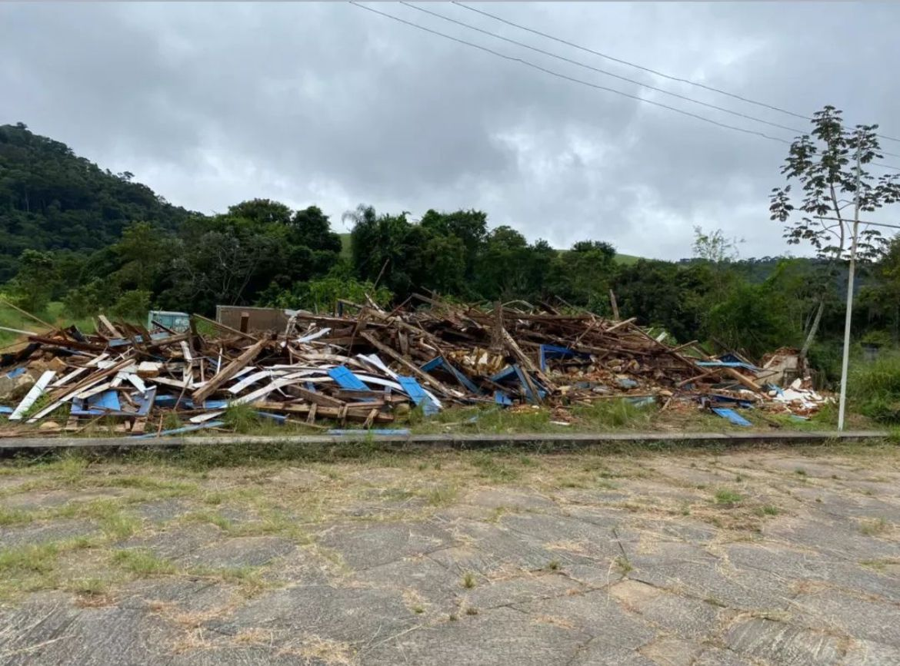
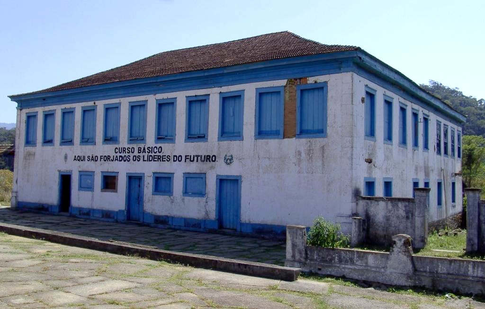
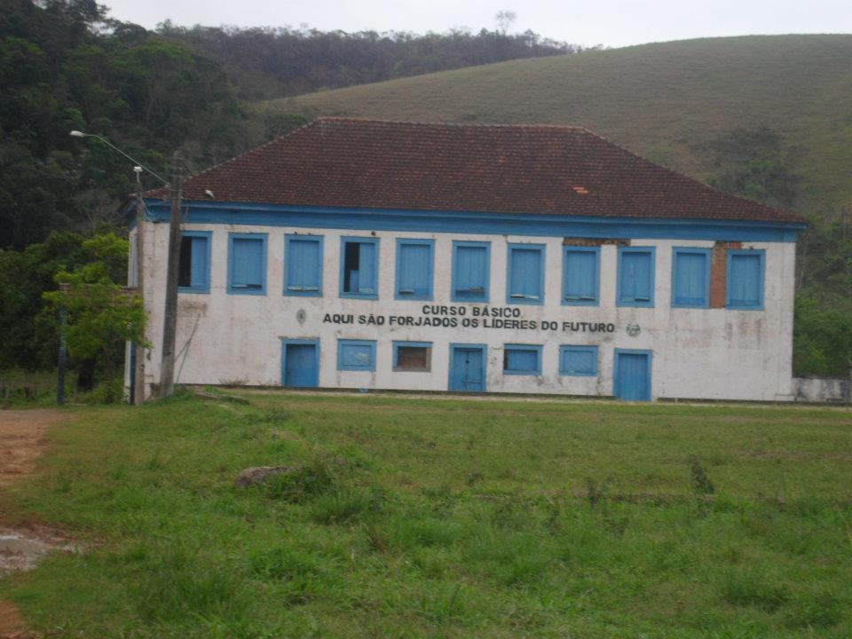
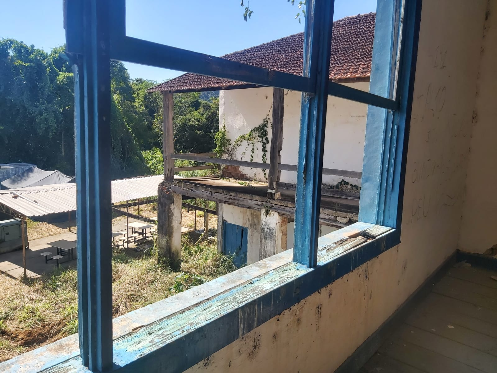
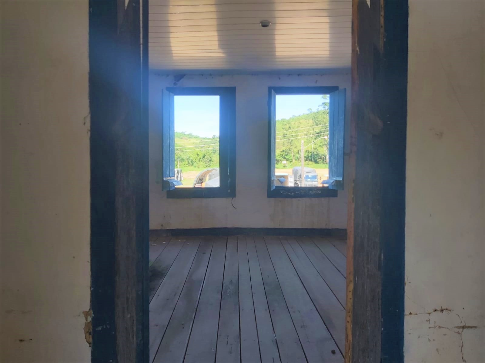
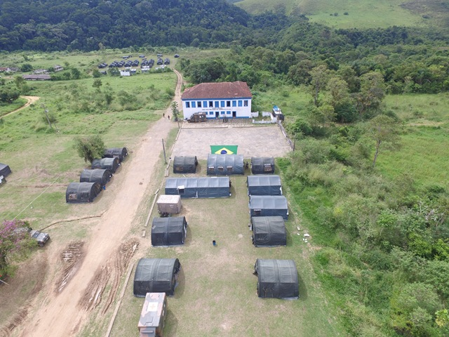
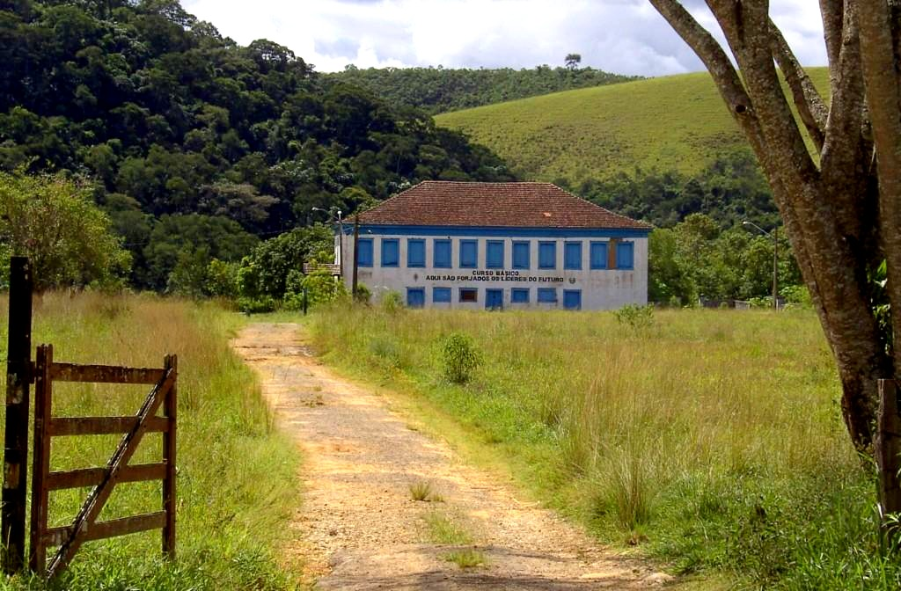

+++
title = 'Boa Esperança'
date = 2024-04-18T21:25:00-03:00
draft = false
description = 'Uma reflexão sobre o simbolismo da demolição sede da Fazenda Boa Esperança.'
summary = 'Uma reflexão sobre o simbolismo da demolição da sede da Fazenda Boa Esperança.'
showHero = false
tags = ["pensamentos", "EB"]
+++


Usamos símbolos para representar coisas que estão fora da nossa compreensão.


Lugar simbólico para aqueles que lá pisaram, assim era a sede da Fazenda Boa Esperança, com seus dizeres: *Aqui são forjados os líderes do futuro*.

Algo é simbólico quando implica alguma coisa além do seu significado manifesto e imediato: a sede da fazenda era muito mais que aquela construção.

Durante a formação da Academia Militar das Agulhas Negras, a fazenda era palco
de atividades no terreno e testemunhou gerações de pessoas que entregavam sua juventude em busca de um ideal.

No antigo terreiro de café, entre atividades de treinamento intenso (como devem ser), entrávamos em forma 
para relembrar nossos valores e o quanto custava ser um oficial combatente. Muito sangue, suor e lágrimas ficaram por lá.
> É justo que muito custe o que muito vale.

Então vejo essa foto:

Essa imagem tem uma aspecto inconsciente mais amplo, que não dá pra
ser definido ou explicado.

Para quem viveu essa geração de Agulhas Negras, ver ela assim também é símbolo.
Símbolo do sentimento que muitos tem (e disciplinadamente não expressam) ao confrontar as promessas de combate que entramos e o treinamento que tivemos com a burocracia e ações sociais que nos reduzimos.

A decadência do lugar e o fim que ela tomou, refletem simbolicamente esse sentimento, tão forte que as vezes transborda, como nesse relato de um contemporâneo:

>O relatório do MD sobre as urnas foi a maior covardia que já vi dos generais.
>No 9 de janeiro, dia que a gente prendeu todos na praça dos cristais, eu repensei muito o que estava fazendo como soldado.
>
>Se um dia vocês vierem para Brasília, talvez percebam a quantidade de general merda que existe: 99,9% está preocupado com ego.
>Tinha um general lá no vídeo, que tava sentado atrás dos deputados, que mandou a gente organizar um truco para ele e outros generais, enquanto a tropa tava se fudendo 24 hrs por dia com manifestante nos xingando.
>
>No dia 9 de janeiro tava rolando um churrasco dos generais na vila, regado a comida do quartel, enquanto a gente prendia o povo.
>
>Quando eu vejo tenente mais preocupado com ponto em sicapex, habilitar em idioma, missão no exterior, sem saber o nome dos seus soldados, eu vejo que tamo perdido.
>
>Entrei no EB por ideal, talvez a maioria, mas acho que com o passar do tempo isso se perdeu… muita gente preocupada com carreira, em ser servido…
>
>Infelizmente não confio no EB como instituição… confio nos soldados (no sentido amplo da palavra), nos verdadeiros soldados.
>
>Quantos aos generais… não passam de covardes (poucas exceções)

Ver essa imagem e ler esse relato mexeram com esse veterano.

## Como era

Foi perdida a chance de reestruturar, reerguer e preservar esse lugar, como símbolo que era. Quando as coisas vão pro chão, pouco importa se isso era legalmente possível ou não.

Que o Senhor dos Exércitos permita que, aqueles que tiverem estômago para permanecer na carreira das armas, consigam fazer isso na instituição.

# Registros
Ficam aqui, como recordação para os que passaram e motivação para os que virão na estreita senda, alguns registros desse lugar místico que marcou uma geração de oficiais.


  
  
  
  
  
  
  




Aço.